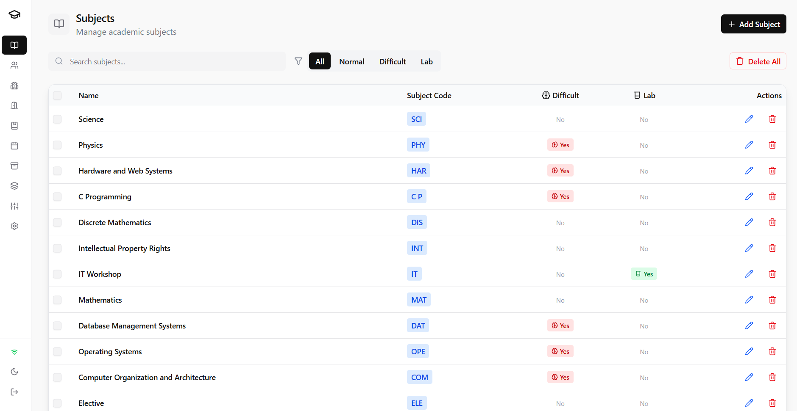
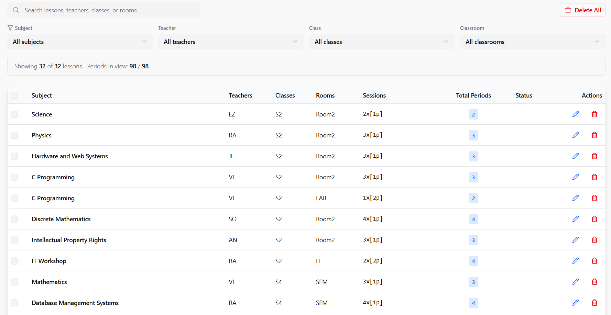
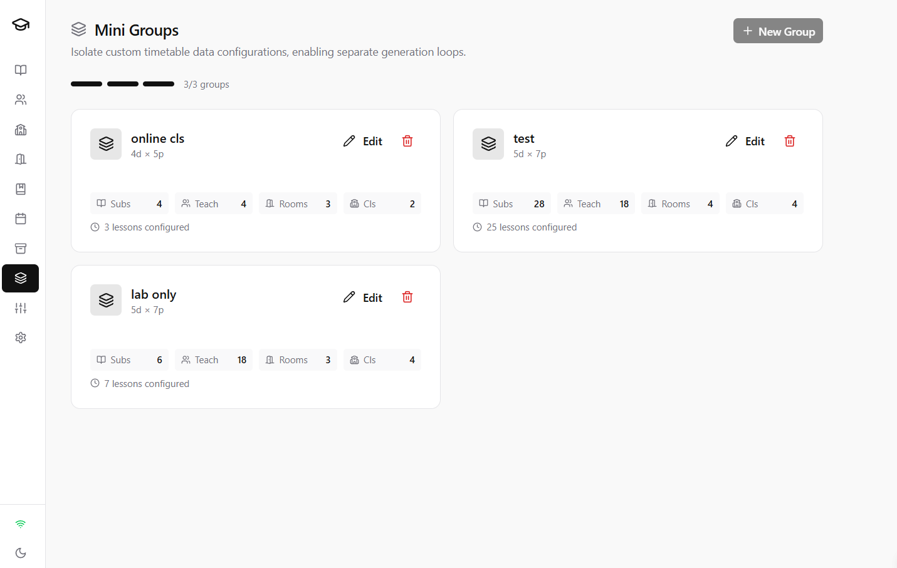
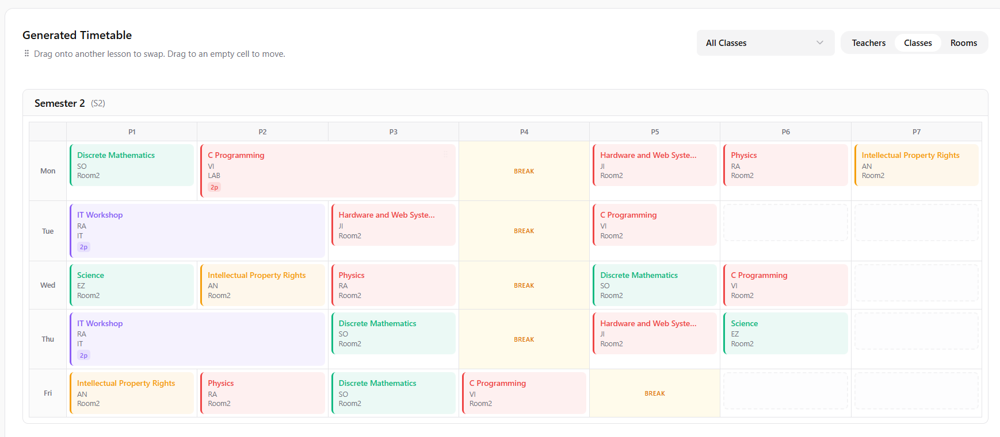
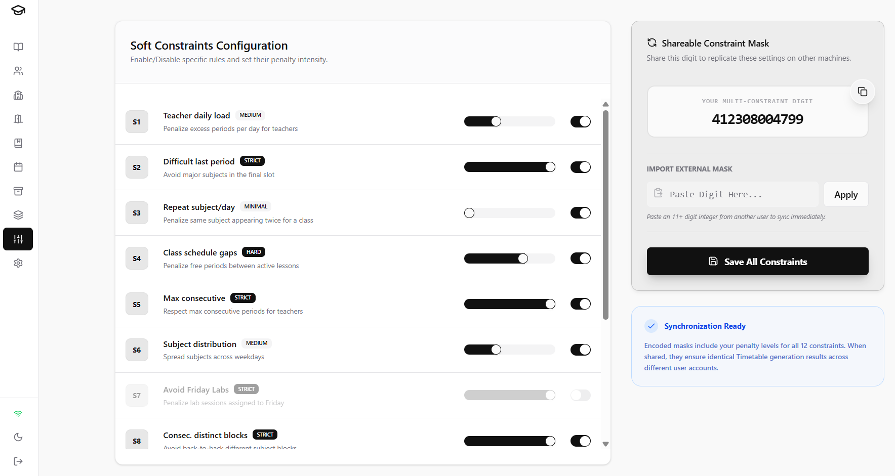
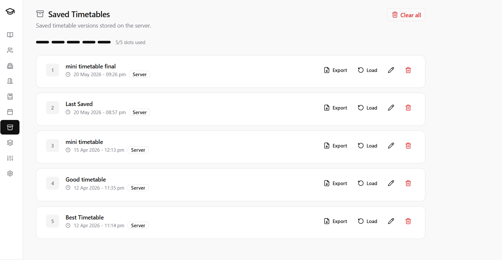
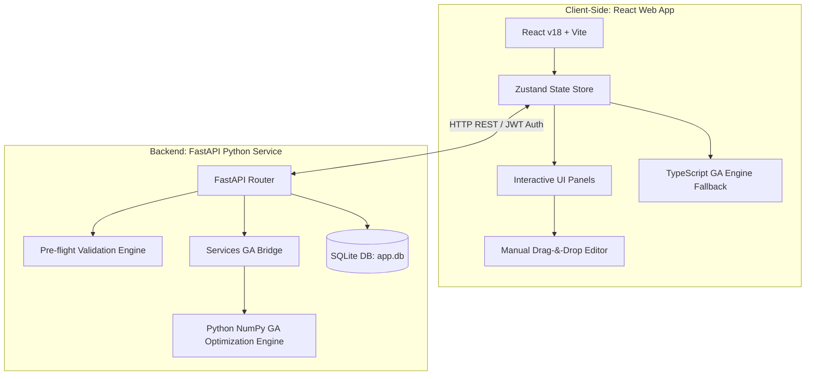

# AutoScheduler

AutoScheduler is a high-performance academic timetable optimization suite designed to solve complex institutional scheduling conflicts. Driven by an advanced Genetic Algorithm (GA) solver, the application features an interactive drag-and-drop grid interface, dynamic constraint customization, and modular mini-group divisions to handle administrative demands and scheduling emergencies.

The system is architected as a decoupled React-FastAPI application, with a high-performance Python engine for server-side generation, and a single-file SQLite database for secure, on-premises data storage.

---

## Core Features

### 1. User Interface for Resource Management

The application provides an intuitive dashboard for managing institutional resources: Subjects, Teachers, Classes, and Classrooms. Instructors can be configured with specific, hour-level unavailability slots. To accommodate different working environments, the interface supports multiple theme and light modes.



### 2. Lesson Block Creation and Management

Core scheduling units are grouped into "Lesson Blocks." Administrators can easily package multiple instructors, classes (student groups), subject durations, and classroom preferences into unified constraints. This prevents scheduling gaps and aligns curricular structures before executing the solver.



### 3. Mini-Group Constructions for Emergency Timetables

In scenarios such as mid-semester staff changes, local lockdowns, or departmental reorganizations, the system allows the partitioning of institutional resources into isolated "Mini-Groups." This permits the generation of independent, localized sub-timetables without modifying or corrupting the master schedule.



### 4. Interactive Drag-and-Drop Timetable Editor

Following schedule generation, administrators can make manual adjustments directly on the output grid. The interactive interface supports smooth drag-and-drop operations, letting users swap periods, change classrooms, and permanently lock specific lessons to slots to freeze them against future generation runs.



### 5. Constraint Evaluator with Sliding Weights and Toggles

Soft scheduling preferences are configured via an interactive Settings panel. Using responsive sliders and toggle switches, users can dynamically tune the penalties of the optimization engine, including teacher consecutive load limits, student gap hour minimization, subject distribution across the week, and morning lab avoidance.



### 6. Genetic Algorithm Optimization Engine

The core solver relies on an evolutionary heuristic algorithm:

- **Chromosome Encoding**: maps lesson block sessions dynamically to three-dimensional coordinates (Day, Period, Classroom).
- **Hard Constraints**: strictly enforces absolute rules (no teacher double-booking, no classroom over-allocations, and no student group overlaps).
- **Soft Constraints**: computes a comprehensive fitness penalty score using user-configured weights to optimize comfort and efficiency.
- **Operators**: implements selection, crossover, and mutation across customizable generations.

### 7. History Management and PDF Export

Timetables are saved to a historical registry for persistent reference. Users can reload past schedules to review generation parameters, make secondary manual edits, or export professional, print-ready PDF documents directly from the browser.



### 8. Locally Deployed and Shareable Database

All application data is consolidated within a local SQLite database (`app.db`). This file-based persistence model keeps institutional records entirely on-premises under your control. The database is easily shareable and transportable; backup routines can duplicate and stamp the file for rapid recovery.

---

## Architecture and System Topology

The system uses a decoupled client-server architecture. For standalone deployment, a complete browser-side fallback engine is integrated so that scheduling optimization can run offline if the backend service is unavailable.



---

## Installation and Setup

### Prerequisites

Ensure the following software is installed on the host machine:

- **Node.js** (v18.0.0 or higher)
- **Python** (v3.10.0 or higher)

### Environment Configuration

1. Duplicate the `.env.example` file at the root of the project:
   ```bash
   cp .env.example .env
   ```
2. Configure the system keys inside `.env` (default values are suitable for local development):
   - `VITE_API_URL`: The endpoint URL the frontend uses to communicate with the API.
   - `JWT_SECRET`: The secret key used to sign authentication tokens.

### Automated Setup

- **On Windows**:
  Double-click `setup_windows.bat` in the root folder, or execute:
  ```cmd
  setup_windows.bat
  ```
- **On macOS / Linux**:
  Open a terminal in the root directory, ensure the script is executable, and execute:
  ```bash
  chmod +x setup_linux.sh
  ./setup_linux.sh
  ```
  _(The setup script verifies runtimes, installs root, frontend, and backend dependencies, mirrors configurations, and prepares the SQLite database)._

### Running the Application in Development Mode

- **On Windows**:
  Double-click `start_windows.bat` in the root folder, or execute:
  ```cmd
  start_windows.bat
  ```
- **On macOS / Linux**:
  Ensure the script is executable and launch the concurrently run environment:
  ```bash
  chmod +x start_linux.sh
  ./start_linux.sh
  ```

Once running, the following endpoints are available:

- **Frontend Web App**: http://localhost:5173
- **Backend REST API**: http://localhost:8000
- **API Documentation**: http://localhost:8000/docs (Swagger UI)

---

## Operational Scripts Reference

Execute these commands from the root directory of the workspace:

| Script                 | Purpose                                                                 |
| :--------------------- | :---------------------------------------------------------------------- |
| `npm run setup`        | Installs dependencies across the root directory and sub-folders.        |
| `npm run dev`          | Starts frontend (Vite) and backend (FastAPI) servers concurrently.      |
| `npm run dev:frontend` | Launches only the React frontend application.                           |
| `npm run dev:backend`  | Launches only the FastAPI backend server.                               |
| `npm run build`        | Compiles frontend assets into highly optimized static production files. |

---

## Administration and Database Maintenance

### First-Time Account Setup

1. On initial startup, the database is empty. The application automatically redirects to a **"Create Admin Account"** screen.
2. Enter your preferred administrator credentials (password must be at least 6 characters).
3. Subsequent sessions will display a standard **"Sign In"** dialog, and endpoint authorization is managed via secure JWT tokens valid for 7 days.

### Database Backups

To safeguard institutional data prior to major scheduler operations:

- **On Windows**: Double-click `backup_windows.bat` (or execute it in a command shell).
- **On macOS / Linux**: Ensure the script is executable and execute:
  ```bash
  chmod +x backup_linux.sh
  ./backup_linux.sh
  ```
- This duplicates the active database file (`backend/app.db`) and saves a timestamped copy in the `backups/` directory.

---

## Production Deployment

### Frontend Hosting

1. Build the production assets:
   ```bash
   npm run build
   ```
2. Deploy the generated output folder (`frontend/dist/`) to static hosting platforms such as Vercel, Netlify, or GitHub Pages.
3. Configure the environment variable: `VITE_API_URL=https://your-backend-api.com`.

### Backend Hosting

1. Host the `backend/` directory on a cloud platform that supports Python runtimes (e.g., Render, Railway, or AWS EC2).
2. Configure the startup command:
   ```bash
   python -m uvicorn main:app --host 0.0.0.0 --port 8000
   ```
3. Establish environment variables on your platform:
   - `JWT_SECRET`: A secure, high-entropy key phrase.

---

## Diagnostics and Troubleshooting

### "Cannot reach the backend server"

- Ensure that the backend process is running and bound to port `8000`.
- Check if a local firewall or security tool is blocking Python from binding to port `8000`.
- Open http://localhost:8000/api/health in your browser to verify API availability.

### "No lesson blocks configured"

- You must configure resources first. Go to **Subjects** $\rightarrow$ **Teachers** $\rightarrow$ **Classes** $\rightarrow$ **Classrooms** to add items.
- Navigate to the **Lessons** panel and create at least one lesson block combining these elements before launching the generator.

### Optimal Scheduling Infeasibility

- If the GA solver fails to converge on a conflict-free solution, your physical constraints may be mathematically impossible (e.g., a teacher assigned more teaching periods than the total periods in the weekly setup).
- Run the **Pre-flight Check** inside the generation panel to get an automatic analysis of structural issues.
- Adjust soft-constraint sliders in the **Settings** panel to lower penalty intensities or disable non-essential preferences.

### Database Reset

- To clear all local data and recreate the initial administrator user, shut down the running server process, delete the database file at `backend/app.db`, and restart the environment.

---

## License

AutoScheduler is open-source software. All rights reserved. Custom integrations or technical inquiries should be directed to the institutional engineering administration.
